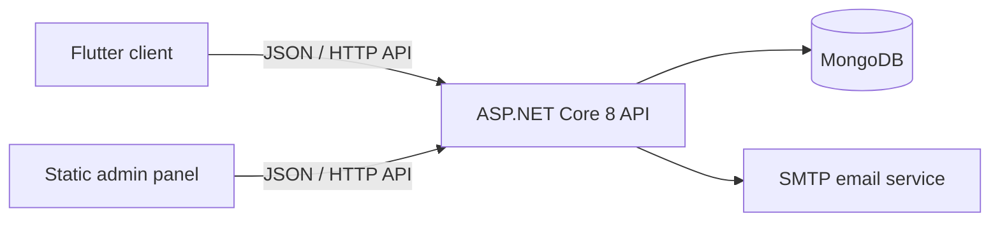

# Technocare

Technocare is a full-stack engineering-services and commerce platform. The repository contains an ASP.NET Core API backed by MongoDB, a cross-platform Flutter client, and a browser-based administration panel served by the API.

## What the project provides

- Customer registration, email verification, login, password recovery, and JWT-based sessions
- Product and category browsing, filtering, carts, checkout, and order tracking
- Engineering project catalogue and detail pages
- Service and education application forms
- User and administrator notifications
- Administrator workflows for products, categories, orders, users, applications, projects, and notifications
- Flutter targets for Android, iOS, web, Windows, Linux, and macOS

## Architecture



| Area | Location | Main technologies |
| --- | --- | --- |
| Backend API | `backendMAIN/` | ASP.NET Core 8, MongoDB Driver, JWT, BCrypt, MailKit, Swagger |
| Admin panel | `backendMAIN/wwwroot/admin/` | HTML, CSS, JavaScript, Axios |
| Client app | `t_app/` | Flutter, Dart, Provider, SharedPreferences, Firebase Messaging |

## Repository structure

```text
.
|-- backendMAIN/
|   |-- Controllers/       # REST API endpoints
|   |-- Models/            # MongoDB documents and request/response models
|   |-- Services/          # Application and persistence services
|   |-- wwwroot/admin/     # Static administration interface
|   |-- Program.cs         # Dependency injection and HTTP pipeline
|   `-- backend.sln
|-- t_app/
|   |-- lib/screens/       # Flutter screens
|   |-- lib/main.dart      # App entry point, API client, and auth provider
|   |-- assets/            # Images and application icons
|   `-- pubspec.yaml
`-- README.md
```

## Prerequisites

- [.NET 8 SDK](https://dotnet.microsoft.com/download/dotnet/8.0)
- A MongoDB deployment (local MongoDB or MongoDB Atlas)
- SMTP credentials for transactional email
- [Flutter](https://docs.flutter.dev/get-started/install) with Dart 3.8 or later
- Platform tooling for the Flutter target you plan to run, such as Android Studio, Xcode, or Visual Studio with Desktop development with C++

## Backend configuration

The real configuration files are intentionally ignored because they contain credentials. Create a local configuration from the supplied template:

```powershell
Copy-Item backendMAIN/appsettings.example.json backendMAIN/appsettings.Development.json
```

Fill in these configuration groups:

| Group | Purpose |
| --- | --- |
| `MongoDbSettings` | MongoDB connection string, database name, and collection names |
| `JwtSettings` | Signing secret, token lifetime, issuer, and audience |
| `AdminSettings` | Bootstrap administrator email address and password |
| `EmailSettings` | SMTP host, port, account, password, sender address, and sender name |

ASP.NET Core environment variables can be used instead of storing secrets in JSON. Nested keys use double underscores, for example `MongoDbSettings__ConnectionString`, `JwtSettings__Secret`, `AdminSettings__Password`, and `EmailSettings__SmtpPass`.

Never commit production credentials, local `appsettings` files, Android signing files, or publish profiles. If credentials have previously been committed, remove them from Git history and rotate them; adding a file to `.gitignore` does not erase earlier commits.

## Run the backend

```powershell
Set-Location backendMAIN
dotnet restore
dotnet run --launch-profile https
```

With the checked-in launch profile, Swagger is available at `https://localhost:7244/swagger`.

The main API groups are:

| Resource | Base route |
| --- | --- |
| Authentication and users | `/api/auth` |
| Administrator actions | `/api/admin` |
| Products | `/api/products` |
| Categories | `/api/categories` |
| Carts | `/api/carts` |
| Orders | `/api/orders` |
| Projects | `/api/projects` |
| Notifications | `/api/notifications` |
| Service applications | `/api/serviceapplications` |
| Education applications | `/api/educationapplications` |

Use Swagger for the complete request and response contract.

## Run the Flutter app

```powershell
Set-Location t_app
flutter pub get
flutter run
```

The current client contains the deployed API URL in `lib/main.dart` and several screen files. Update all occurrences when targeting a local backend. Typical local values are:

- Android emulator: `https://10.0.2.2:7244/api`
- Desktop or web on the same machine: `https://localhost:7244/api`
- Physical device: the development machine's reachable LAN address

The Android manifest must allow network access, and a physical device must be able to reach the API host and trust its HTTPS certificate.

## Validation

Run the backend and client checks independently:

```powershell
# Backend
dotnet restore backendMAIN/backend.sln
dotnet build backendMAIN/backend.sln --no-restore
dotnet test backendMAIN/backend.sln --no-build

# Flutter
Set-Location t_app
flutter pub get
flutter analyze
flutter test
```

There is currently no dedicated backend test project. The Flutter widget test is still based on the generated starter test and should be updated to exercise `TechnocareApp` before it is used as a CI quality gate.

## Production checklist

Before a production deployment:

- Move every credential to a managed secret store or environment variables and rotate previously exposed values.
- Remove hard-coded administrator credentials and provision administrators through a controlled process.
- Verify authentication middleware and apply explicit authorization policies to every privileged endpoint.
- Restrict CORS to trusted origins and expose Swagger only where intended.
- Require valid HTTPS certificates; do not accept invalid certificates in the client.
- Replace repeated hard-coded API URLs with a single environment-specific client configuration.
- Add backend integration tests and replace the generated Flutter smoke test.
