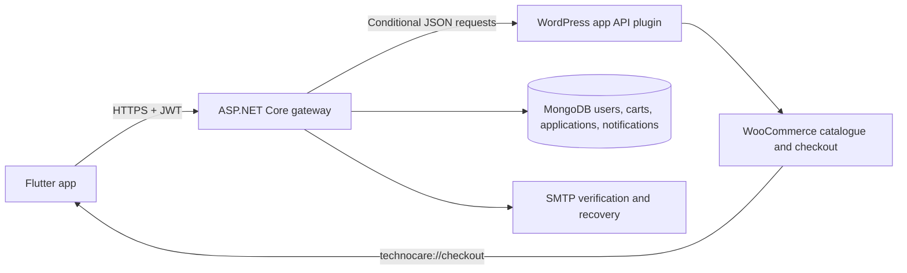

# Technocare live mobile app

Technocare is a Flutter Android/iOS application backed by ASP.NET Core 8 and the live [technocare.az](https://technocare.az/) WordPress/WooCommerce site. WordPress remains the source of truth for homepage sections, services, education, projects, products, prices, stock, brands, and categories. Supported website changes reach the app through a five-minute conditional cache without a mobile release.

## Architecture



- Flutter never parses Elementor HTML and never trusts client-supplied prices.
- The WordPress plugin converts supported Elementor sections into ordered, typed JSON blocks.
- The backend isolates the app from WordPress response details, retries safe reads, caches for five minutes, and returns stale content during temporary website failures.
- The native cart stores numeric WooCommerce product IDs. WooCommerce revalidates product availability and current pricing before checkout.
- Payment, address, and delivery data remain inside WooCommerce checkout.
- Legacy MongoDB products, carts, orders, categories, and projects are retained behind admin-only `/api/internal/legacy/*` routes; the mobile app does not use them.

## Repository layout

| Path | Purpose |
| --- | --- |
| `wordpress/technocare-app-api/` | Versioned WordPress/WooCommerce integration plugin |
| `backendMAIN/` | ASP.NET Core gateway, identity, applications, notifications, cart coordination, admin UI |
| `backendMAIN.Tests/` | Backend contract, authorization, and sanitized-error tests |
| `t_app/` | Flutter Android/iOS client |
| `.github/workflows/ci.yml` | Backend, Flutter, and WordPress validation |

## Public API

WordPress plugin:

| Method | Route |
| --- | --- |
| GET | `/wp-json/technocare-app/v1/home` |
| GET | `/wp-json/technocare-app/v1/products` |
| GET | `/wp-json/technocare-app/v1/products/{id}` |
| GET | `/wp-json/technocare-app/v1/categories` |
| GET | `/wp-json/technocare-app/v1/brands` |
| GET | `/wp-json/technocare-app/v1/projects` |
| GET | `/wp-json/technocare-app/v1/services` |
| GET | `/wp-json/technocare-app/v1/education` |

The signed checkout and order endpoints are for the backend only.

Backend gateway:

| Access | Route |
| --- | --- |
| Public | `GET /api/v1/content/home` |
| Public | `GET /api/v1/content/projects`, `/services`, `/education` |
| Public | `GET /api/v1/shop/products`, `/products/{id}`, `/categories`, `/brands` |
| JWT | `/api/v1/shop/cart`, `/checkout-session`, `/orders` |
| JWT | `/api/notifications/my-notifications` |
| Public submission | `/api/serviceapplications`, `/api/educationapplications` |

Product search supports Azerbaijani text, exact/prefix SKU ranking, product name, brand/category, and description matching; category, brand, stock, and price filters; pagination; and relevance, popularity, latest, name, and price sorting.

## 1. Install the WordPress plugin

1. Copy `wordpress/technocare-app-api` to `wp-content/plugins/` on technocare.az.
2. Define a long random shared secret outside the repository in `wp-config.php`:

   ```php
   define('TECHNOCARE_APP_SHARED_SECRET', 'replace-with-at-least-32-random-characters');
   ```

3. Activate **Technocare App API** in WordPress.
4. Open **Settings → Technocare App**, select the published homepage, and confirm supported section visibility/order.
5. Ensure WooCommerce checkout pages and pretty permalinks are configured.

The plugin reads rendered published content, WooCommerce records, and portfolio pages. Header/footer markup and unsupported sections are not sent. A genuinely new Elementor layout still needs a matching typed block and Flutter renderer.

## 2. Configure and run the backend

Prerequisites: .NET 8 SDK, MongoDB, SMTP credentials, and a valid HTTPS hostname such as `https://api.technocare.az`.

```powershell
Copy-Item backendMAIN/appsettings.example.json backendMAIN/appsettings.Development.json
dotnet restore backendMAIN/backend.csproj
dotnet run --project backendMAIN/backend.csproj --launch-profile https
```

Set secrets using environment variables in production:

```text
MongoDbSettings__ConnectionString
JwtSettings__Secret
TechnocareSite__SharedSecret
EmailSettings__SmtpPass
AdminSettings__Password
```

`TechnocareSite__SharedSecret` must exactly match `TECHNOCARE_APP_SHARED_SECRET`. Configure `Cors__AllowedOrigins__0` only for trusted browser origins. Native mobile requests do not require permissive CORS.

Deploy behind a reverse proxy that forwards `X-Forwarded-For` and `X-Forwarded-Proto`, binds a valid TLS certificate, and redirects HTTP to HTTPS. `/health` checks WordPress and MongoDB dependencies.

## 3. Run the Flutter app

Prerequisites: Flutter stable with Dart 3.8 or later and Android Studio or Xcode.

```powershell
Set-Location t_app
flutter pub get
flutter run --dart-define=API_BASE_URL=https://api.technocare.az/api
```

Use the same define for release builds:

```powershell
flutter build appbundle --release --dart-define=API_BASE_URL=https://api.technocare.az/api
flutter build ipa --release --dart-define=API_BASE_URL=https://api.technocare.az/api
```

JWTs are stored with platform secure storage. The app registers `technocare://checkout/success` and `technocare://checkout/cancel` for WooCommerce checkout returns. Android cleartext traffic and invalid-certificate overrides are disabled.

## Validation

```powershell
dotnet test backendMAIN.Tests/backendMAIN.Tests.csproj

Set-Location t_app
flutter analyze --no-fatal-infos --no-fatal-warnings
flutter test

php -l ..\wordpress\technocare-app-api\technocare-app-api.php
```

CI runs the same backend, Flutter, WordPress syntax, and insecure-client checks on `main`, pull requests, and `codex/**` branches.

## Rollout order

1. Install and verify the WordPress plugin endpoints.
2. Deploy the backend to a valid HTTPS endpoint with production secrets.
3. Set DNS/TLS for `api.technocare.az` (or supply another HTTPS URL at build time).
4. Produce an internal Android/iOS build and complete checkout/app-link tests.
5. Release the mobile builds.

After deployment, verify that editing homepage text, changing product price/stock, reordering a supported section, and hiding a section appear in the app within five minutes.

## Security notes

- Do not commit `appsettings.*.json`, `.env` files, signing keys, certificates, SMTP passwords, JWT secrets, or the WordPress shared secret.
- Signed WordPress writes include a timestamp, single-use nonce, and HMAC signature.
- Swagger is development-only, errors are returned as sanitized Problem Details, and privileged routes require the Admin role.
- A successful account deletion removes the Technocare user and native carts; WooCommerce orders remain under the store's retention policy.
